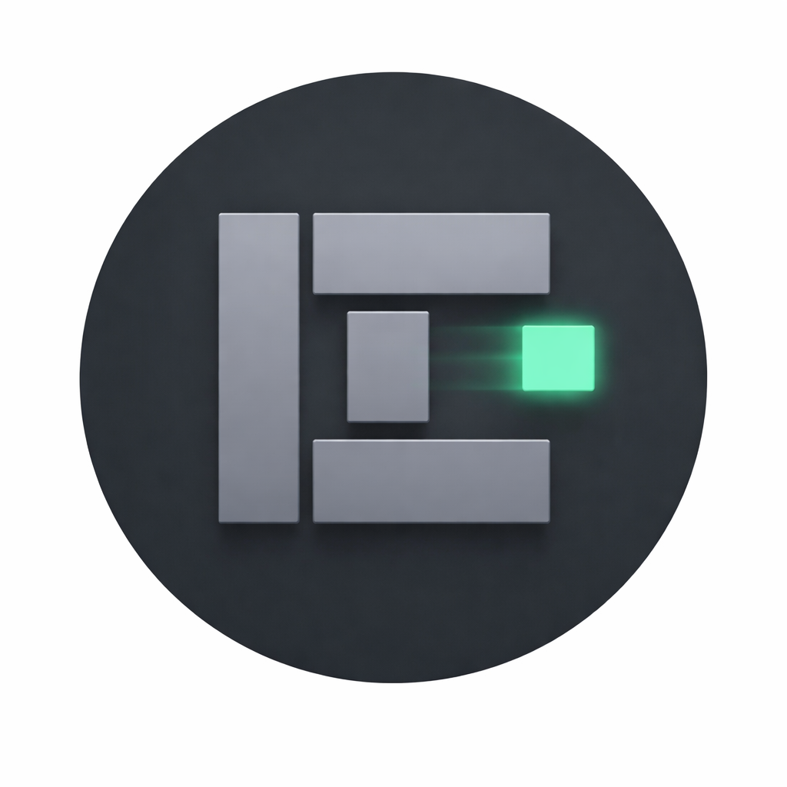

<p align="center">
  
</p>

# 🎬 EmbedCast

[](https://opensource.org/licenses/MIT)
[](https://android-arsenal.com/api?level=24)
[](https://kotlinlang.org)
[](https://dotnet.microsoft.com)
[](https://developer.mozilla.org/en-US/docs/Web/API/WebSocket)
[](https://github.com/MoriNo23/embedCast/stargazers)
[](https://github.com/MoriNo23/embedCast/issues)
[](https://github.com/MoriNo23/embedCast/actions)
[](https://github.com/MoriNo23/embedCast/commits)

> **EmbedCast** is an Android TV application for video casting and playback. Cast videos from a Linux host to your Android TV device with full remote control via WebSocket.

## 🎥 Demo

> TODO: Add a demo GIF or screenshot of the application

## 🚀 Quick Start

### Download & Install

| Platform | Download | Instructions |
|----------|----------|--------------|
| Android TV | [Latest Release](https://github.com/MoriNo23/embedCast/releases/latest) | Download APK → Install on TV |
| Linux CLI | [Latest Release](https://github.com/MoriNo23/embedCast/releases/latest) | Extract → Run `./cli-tool` |
| Web GUI | [Latest Release](https://github.com/MoriNo23/embedCast/releases/latest) | Extract → Run `./web-gui` |

## ✨ Features

- 🎥 **Video Casting** - Cast videos from Linux host to Android TV
- 🎮 **Remote Control** - Full playback control via WebSocket
- ⏯️ **Playback Controls** - Play, pause, seek, stop, quality selection
- 📺 **Android TV Optimized** - Built with Leanback for TV experience
- 🔄 **Auto-Reconnect** - Automatic WebSocket reconnection on disconnect
- 💾 **Resume Playback** - Save and restore video positions
- 🎨 **Animated Splash** - Custom animated splash screen with logo
- 📡 **Real-time Status** - Live video status synchronization

## 📋 Table of Contents

- [Features](#-features)
- [Architecture](#-architecture)
- [Tech Stack](#-tech-stack)
- [Project Structure](#-project-structure)
- [Getting Started](#-getting-started)
  - [Prerequisites](#prerequisites)
  - [Installation](#installation)
- [Usage](#-usage)
- [API Reference](#-api-reference)
- [Contributing](#-contributing)
- [Changelog](#-changelog)
- [Roadmap](#-roadmap)
- [License](#-license)

## 🏗️ Architecture

```
┌─────────────────┐     WebSocket (8080)     ┌─────────────────┐
│                 │◄────────────────────────►│                 │
│   Linux Host    │                          │   Android TV    │
│   (CLI/Web GUI) │     JSON Protocol        │   (EmbedCast)   │
│                 │                          │                 │
└─────────────────┘                          └─────────────────┘
```

### Communication Protocol

| Action   | Description              | Parameters           |
| -------- | ------------------------ | -------------------- |
| `load`   | Load video URL           | `url: string`       |
| `play`   | Play/Pause toggle        | -                    |
| `pause`  | Pause video              | -                    |
| `stop`   | Stop and reset           | -                    |
| `seek`   | Seek to position         | `seconds: int`       |
| `quality`| Change video quality     | `value: string`      |
| `reload` | Force reload (new token) | -                    |

## 🛠️ Tech Stack

### Android TV App
| Component | Technology |
|-----------|------------|
| Language | Kotlin |
| Min SDK | 24 (Android 7.0) |
| Target SDK | 34 (Android 14) |
| UI Framework | Android TV Leanback |
| Video Player | JWPlayer (WebView) |
| Networking | Java-WebSocket 1.5.4 |
| Media | AndroidX Media 1.7.0 |

### Linux Host
| Component | Technology |
|-----------|------------|
| CLI Tool | .NET 10.0 (C#) |
| Web GUI | ASP.NET Core 10.0 |
| Update Server | Python 3 |

## 📁 Project Structure

```
embedCast/
├── embedCast-tv/                 # Android TV Application
│   ├── app/
│   │   ├── build.gradle.kts
│   │   └── src/main/
│   │       ├── java/com/tvremote/control/
│   │       │   ├── MainActivity.kt
│   │       │   ├── SplashActivity.kt
│   │       │   ├── VideoPlayerManager.kt
│   │       │   ├── WebSocketManager.kt
│   │       │   └── PreferencesManager.kt
│   │       ├── res/
│   │       └── AndroidManifest.xml
│   └── gradle/
├── embedCast-host/               # Linux Host Controller
│   ├── cli-tool/                # Command-line interface
│   ├── web-gui/                 # Web-based GUI
│   └── userscripts/              # Browser userscripts
├── experimental/                 # Work in Progress
├── docs/                         # Documentation
├── assets/                       # Static assets
├── AGENTS.md                     # AI Assistant Guide
├── LICENSE                       # MIT License
└── README.md
```

## 🚀 Getting Started

### Prerequisites

| Tool | Version | Purpose |
|------|---------|---------|
| Android Studio | Hedgehog (2024.1)+ | Android development |
| JDK | 17+ | Java compilation |
| Android SDK | API 34 | Android platform |
| .NET SDK | 10.0+ | Host tools |
| Python | 3.10+ | Update server |

### Installation

```bash
# 1. Clone the repository
git clone https://github.com/MoriNo23/embedCast.git
cd embedCast

# 2. Android TV
cd embedCast-tv
echo "sdk.dir=/path/to/your/Android/Sdk" > local.properties
./gradlew assembleDebug

# 3. Install on device
./gradlew installDebug

# 4. Host tools (optional)
cd ../embedCast-host/cli-tool
dotnet build --configuration Release
```

## 📖 Usage

### WebSocket Server

The Android TV app automatically starts a WebSocket server on port 8080 when launched.

```kotlin
// Server starts automatically in MainActivity
webSocketManager.startServer { json -> 
    handleCommand(json) 
}
```

### Sending Commands

```bash
# CLI tool
./cli-tool load "https://example.com/video.mp4"
./cli-tool play
./cli-tool pause

# Python example
import websocket
ws = websocket.WebSocket()
ws.connect("ws://TV_IP:8080")
ws.send('{"action": "play"}')
```

## 📡 API Reference

### WebSocket Messages

**Request:**
```json
{
  "action": "load|play|pause|stop|seek|quality|reload",
  "url": "https://...",
  "seconds": 10,
  "value": "1"
}
```

**Response:**
```json
{
  "type": "status",
  "currentTime": 120.5,
  "duration": 3600.0,
  "paused": false
}
```

## 🤝 Contributing

Contributions are welcome! Please read our [Code of Conduct](CODE_OF_CONDUCT.md) first.

### Guidelines

1. Fork the repository
2. Create your feature branch (`git checkout -b feature/AmazingFeature`)
3. Commit your changes with clear messages
4. Push to the branch
5. Open a Pull Request

### Development Standards

- Follow [Kotlin Coding Conventions](https://kotlinlang.org/docs/coding-conventions.html)
- Keep `MainActivity.kt` under 500 lines
- Use `PackageInfoCompat` for version checks
- Test WebSocket compatibility after changes

## 📝 Changelog

All notable changes are documented in [CHANGELOG.md](CHANGELOG.md).

### v1.0.0 (Initial Release)
- Android TV application for video casting
- WebSocket-based remote control
- Linux CLI and Web GUI tools
- Resume playback functionality
- Auto-reconnect feature

## 🗺️ Roadmap

- [ ] Adaptive icons for Android 8.0+
- [x] CI/CD pipeline with GitHub Actions
- [ ] Multi-device casting support
- [ ] Video playlist management
- [ ] Subtitle support
- [ ] Chromecast compatibility
- [ ] iOS companion app

## 📄 License

This project is licensed under the MIT License - see the [LICENSE](LICENSE) file for details.

## 🔒 Security Policy

If you discover a security vulnerability, please report it via:

1. **GitHub Issues** (for non-critical issues)
2. **Email** (for critical vulnerabilities) - contact via GitHub profile

## 📜 Code of Conduct

Please read our [Code of Conduct](CODE_OF_CONDUCT.md) before contributing.

---

⭐ **Star this repo if you find it useful!**
